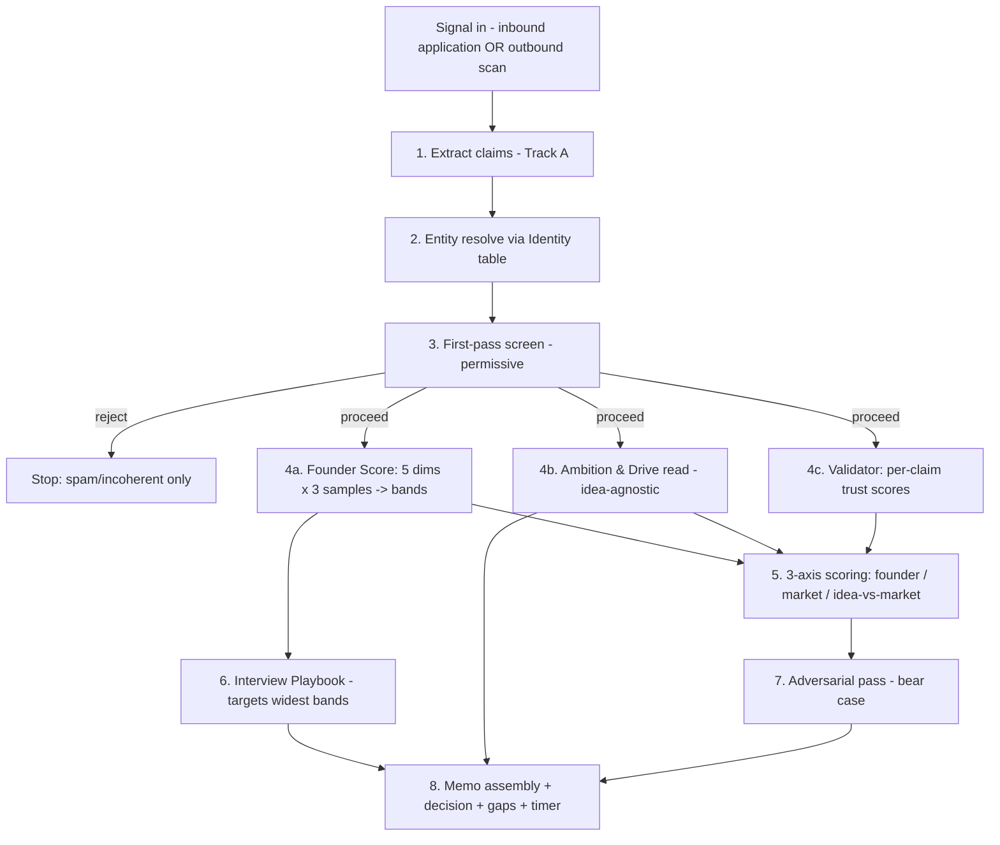
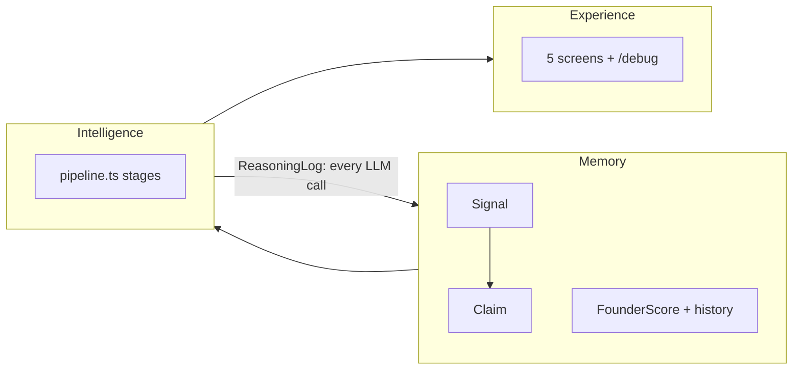

# Architecture

Part of [[main]] · details in [[data-model]] and [[intelligence-layer]].

## Stack

| Layer | Choice | Why (see [[decisions]]) |
|---|---|---|
| Web | Next.js 16 (App Router), TypeScript, Tailwind | Client constraint: Next.js, no Streamlit |
| DB | Postgres (Neon planned) + Prisma 6 | Battle-tested path under time pressure |
| LLM | OpenAI gpt-4.1 family via one wrapper (`lib/llm.ts`) | $50 user credits; `OPENAI_BASE_URL` swaps in open-source |
| Charts | Recharts (radar, timeline, scatter) | Track C |
| Batch data | Adaption Labs (Python, `/scripts/adaption/`) | ~2K credits; **never in request path** |

## Pipeline (the spine of the system)

Stages 4a/4b/4c run **in parallel**, then 5 + 6 in parallel, then 7 → 8. Orchestrated by `lib/intel/pipeline.ts` (`runOpportunityPipeline`), which is **DB-free**: route handlers will wrap it with persistence.

## Layer boundaries

**Iron rules:** every LLM call goes through `runLLM()` (the log IS traceability + cache) · `ScoreHistory`/`ReasoningLog` append-only · visibility never leaks into capability · axes never averaged.
