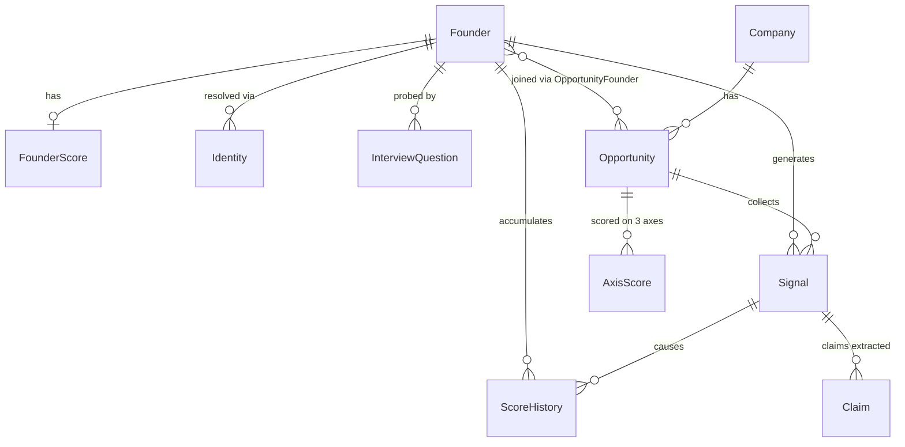

# Data Model

Schema lives in `prisma/schema.prisma`. Contracts in `lib/contracts.ts` (frozen interface — announce changes before merging). See [[architecture]] for how data flows.

## Why each table exists

| Table | Purpose | Key rule |
|---|---|---|
| `Founder` | The person. `context` JSON = Resourcefulness denominator | Founder Score follows the *person* forever (FAQ 6) |
| `FounderScore` | Current 5-dim snapshot, each a band `{value,low,high,coverage}` + `visibilityIndex` + `capabilityVisibilityGap` + `ambitionRead` | Visibility must NEVER feed capability dims |
| `ScoreHistory` | Every band change + `causeSignalId` | **Append-only**; powers trend chart + "never forgets" |
| `Identity` | External handle → founder with `matchConfidence` | Entity resolution across sources |
| `Company` / `Opportunity` | The deal. Status, track, decision, `firstSignalAt`/`decidedAt` | Per-deal scores separate from per-person score |
| `Signal` | Raw evidence, source-tagged, two timestamps (occurred/ingested) | NOTHING discarded |
| `Claim` | Extracted assertion + per-claim `trustScore` + `verificationStatus` + `evidenceRefs` | Trust is per CLAIM, not per company (FAQ 7) |
| `AxisScore` | founder / market / idea_vs_market: value + trend + rationale + cited claims | **Never averaged** (FAQ 5) |
| `InterviewQuestion` | Playbook entries: question + strong/red-flag signatures + expected band reduction | The client's named deliverable |
| `Thesis` | Configurable fund lens | Never hardcoded (FAQ 15) |
| `ReasoningLog` | Every LLM call: step, model, inputs, output, tokens | **Append-only**; doubles as LLM cache + traceability stretch goal |

> [!tip] "I don't know" is a first-class value
> Nullable trust scores, `UNVERIFIED` defaults, explicit gap flags — the brief scores flagged gaps HIGHER than invented numbers.
